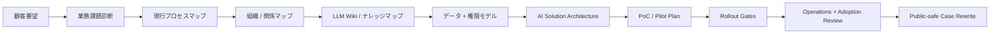

# AI First FDE Skill

AI First FDE Skill は、東アジア企業における AI 現場導入、業務変革、知識整理、PoC、Pilot、Rollout、運用引き継ぎを支援する Markdown-only / no-build の Forward Deployed Engineer Skill Suite です。

この Skill の目的は「AI で人員削減すること」ではありません。目的は「AI で現場を変革すること」です。東アジアの企業では、AI 導入は効率だけでなく、専門性を守ること、残業を減らすこと、手戻りを減らすこと、既存メンバーが反復作業からレビュー・判断・改善・運用管理へ移れることが重要です。これは単なる優しい表現ではなく、この Skill の明確な Selling Point です。人を脅かす AI ではなく、人の経験を活かす AI を前提にします。

## Quick Start

```bash
git clone https://github.com/jacksoncoin0202-ops/ai-first-fde-skill.git
cd ai-first-fde-skill
```

Agent に次のように指示します。

```text
まず skills/ai-first-fde/SKILL.md を読んでください。
調査、診断、アーキテクチャ、デプロイ、トラブルシューティング、採用観察、組織図、企業ナレッジ整理が必要な場合は、対応する skills/ai-first-fde-* モジュールと skills/ai-first-fde/references/ を読んでください。
```

Markdown または project rules を読める agent であれば利用できます。Claude Code、OpenAI Codex CLI、Cursor、Hermes、OpenCode、Gemini CLI、Cline、Aider、Continue、Devin CLI、OpenRouter-backed agents、および類似の CLI / Agent ツールで利用できます。

## Language

- [English](README.en.md)
- [繁體中文](README.zh-Hant.md)
- [简体中文](README.zh-CN.md)
- [日本語](README.ja.md)

## なぜ必要か

企業 AI プロジェクトは、prompt が書けないから失敗するわけではありません。多くの場合、失敗の原因は業務プロセス、組織構造、データ、権限、関係性にあります。

よくある問題は次の通りです。

- 業務フローの owner が不明確。
- 正式な source of truth が分からない。
- 承認プロセスが実際には非公式な人間関係で動いている。
- senior reviewer が AI の出力品質を信頼していない。
- 現場ユーザーが責任追及、追加作業、または置き換えを恐れている。
- legal、security、compliance、procurement、IT が後から巻き込まれる。
- pilot に測定可能な KPI がない。
- 組織構造を理解する前に solution を作り始めている。
- ナレッジが email、spreadsheet、chat、PDF、ticket system、個人の記憶に分散している。

AI First FDE Skill は、これらを実行可能な手順に変換します。Agent が何を聞き、何を図示し、何を納品し、いつ止まり、いつ scale できるかを明確にします。

## 東アジア型 AI 変革の立場

この Skill は、欧米型の「自動化で人を置き換える」rollout playbook ではありません。

日本、香港、台湾、韓国、シンガポール、および類似文化圏の企業チームでは、AI adoption の設計は異なります。

- AI を残業、手戻り、待ち時間、context switching、cognitive load を減らすものとして位置付ける。
- 経験豊富な社員を reviewer、trainer、approver、process owner として活かす。
- AI 指標で現場ユーザーを公開的に責めない。
- 広範囲展開の前に低リスクの quick win を作る。
- manager、senior staff、informal influencer と事前に合意形成する。
- 沈黙、遅延、表面的な同意、低利用率を「不服従」ではなく診断シグナルとして扱う。
- 反復作業から、より価値の高い判断業務へ移る道筋を示す。

これは倫理的な姿勢であると同時に、現実的な導入戦略です。地位や雇用を脅かす AI は抵抗されます。専門性を守り、働き方を改善する AI は、日常業務に定着する可能性が高くなります。

## 何をするか

AI First FDE Skill は、agent を Forward Deployed Engineer のように動かします。

- ツール選定の前に本当の業務課題を特定する。
- 実際の文書、ticket、表、email、log から現行業務を再構成する。
- 組織構造、decision rights、approval route、informal veto point を整理する。
- sponsor、workflow owner、daily users、senior reviewer、staff functions、隠れた抵抗を可視化する。
- 組織アーキテクチャ図、関係図、handoff map、責任マップを作成する。
- 分散した企業ナレッジを LLM Wiki / knowledge base 構造に整理する。
- データソース、権限モデル、ガバナンス境界、監査ログ、人間の承認ポイントを定義する。
- 狭く、回復可能で、測定可能な PoC / Pilot を設計する。
- KPI、validation method、rollback path、operations owner を決める。
- 現場インシデントを層別に診断する。
- 顧客情報を漏らさない public-safe case に書き換える。

## Operating Model



この順序が重要です。最初に model や tool を選ばないでください。まず組織、業務、データ、関係性を見える化し、その後に技術設計を行います。

## Core Capabilities

### 1. 業務フローと課題診断

この Skill は、一般的な AI use case リストから始めません。直近の実例、ticket、spreadsheet、文書、chat thread、承認、手作業の workaround、待ち時間、手戻り、失敗例を確認します。

Problem Map には次を記録します。

- 課題タイプ：時間、エラー、手戻り、リスク、待ち行列、コスト、機会損失、従業員の負担。
- workflow owner。
- daily users。
- approval path。
- current evidence。
- AI が安全に支援できるステップ。
- human approval が必須のステップ。

### 2. 組織アーキテクチャ図と関係図

企業 AI 導入では、software architecture だけでは不十分です。organization architecture が必要です。

この Skill は、以下を作成できます。

- Organization Architecture Map。
- Stakeholder Relationship Map。
- Decision / Approval Route。
- Informal Veto Map。
- Workflow Handoff Map。
- Data Ownership Map。
- Escalation Path。
- AI Operating Responsibility Map。

diagram tool がある環境では、大きく見やすい専門的なアーキテクチャ図や関係図に変換できます。diagram tool がない場合でも、Mermaid と Markdown で出力できるため、GitHub、Notion、Obsidian、社内 wiki、スライド、agent context にそのまま利用できます。

### 3. LLM Wiki と企業ナレッジ整理

多くの企業の問題は、AI の前に「信頼できるナレッジ構造がない」ことです。

AI First FDE Skill は、ナレッジベースを導入範囲の一部として扱います。

- どの文書が source of truth か。
- どの文書が古くなっているか。
- どの team がどの knowledge domain を所有するか。
- どの content を AI が読めるか。
- どの content は部門内に閉じるべきか。
- どの矛盾は人間の確認が必要か。
- どの update は log に残すべきか。
- どの topic を reusable wiki page にするべきか。

Skill は LLM Wiki handoff plan を作成します。内容には domain taxonomy、source register、owner matrix、permission matrix、update cadence、contradiction log、retrieval boundary が含まれます。

### 4. データ、権限、ガバナンスモデル

すべての architecture plan には、次を含めます。

- data sources。
- ingestion path。
- permission boundaries。
- sensitive fields。
- audit logging。
- human approval gates。
- failure modes。
- fallback workflow。
- rollback plan。
- operations owner。

これにより、demo は動くが production で security / compliance / IT / operations review を通らない、という失敗を避けます。

### 5. PoC、Pilot、Rollout、Operations

この Skill は proof と deployment を分けます。

- PoC：実際の artifact で狭いタスクが成立することを確認する。
- Pilot：実ユーザーが制御された workflow で安全に使えることを確認する。
- Rollout：KPI、利用率、リスク制御、owner readiness が揃ってから拡大する。
- Operations：monitoring、support、access review、cost review、quality review、incident response、knowledge refresh を定義する。

## Core and Optional Add-ons

Default の `ai-first-fde` skill は dependency-free core です。Markdown、Mermaid、tables、checklists だけで動作します。

Dependency-based capabilities は [skills/ai-first-fde-addons/SKILL.md](skills/ai-first-fde-addons/SKILL.md) に分離されています。Add-ons を default で install / invoke しないでください。Rendered diagram、knowledge graph、eval harness、security scan、slide deck などの advanced artifact をユーザーが明確に求めた場合だけ使います。

普通の communication / office tools は add-ons ではありません。chat apps、email、calendar、notes、spreadsheets は input sources であり、dependencies ではありません。

| FDE phase | Optional add-on examples | Output |
|---|---|---|
| Research grounding | arXiv、market research、competitive analysis、deep research | Source pack、benchmark notes、public-safe brief |
| Deep diagnostic | support-ticket triage、meeting insight extraction、enterprise AI consulting | Pain clusters、stakeholder questions、diagnostic plan |
| Organization visualization | architecture diagram、graphify、diagramming、Figma、Excalidraw、infographic | Organization map、relationship diagram、approval route |
| Knowledge architecture | LLM Wiki、graphify、codebase onboarding、content hash cache | Source register、taxonomy、owner matrix、contradiction log |
| Agent runtime planning | agent harness、enterprise agent ops、cost-aware LLM pipeline | Runtime table、context strategy、tool boundary、cost route |
| Evaluation and rollout | eval harness、AI regression testing、verification loop、e2e testing | Pilot gates、acceptance tests、rollout readiness |
| Governance and safety | threat model、security review、security scan、public-safe checklist | Permission review、risk model、go / no-go gate |
| Executive enablement | presentations、slide deck、infographic、article writing、brand voice | Executive summary、training deck、public-safe case |

Add-on がない場合でも、core skill は Markdown と Mermaid で同じ artifact を作ります。Install は optional であり、分離して扱います。

## Modules

- `ai-first-fde`：main orchestration skill
- `ai-first-fde-addons`：advanced artifacts 用の optional dependency-based add-ons
- `ai-first-fde-research`：公開情報と根拠確認
- `ai-first-fde-diagnostic`：顧客深掘り診断
- `ai-first-fde-architecture`：AI solution architecture
- `ai-first-fde-deployment`：PoC、Pilot、Rollout、Operations
- `ai-first-fde-troubleshooting`：現場トラブル対応
- `ai-first-fde-adoption-observer`：利用者抵抗と採用状況の観察

## Standard Deliverables

| Deliverable | Purpose |
|---|---|
| Engagement Brief | 顧客、部門、業務、sponsor、制約、30/60/90 日目標を定義する。 |
| Problem Map | 課題、業務、データ、権限、quick wins を見える化する。 |
| Stakeholder Map | sponsor、workflow owner、users、reviewers、staff functions、blockers を特定する。 |
| Organization Architecture Map | 部門、owner、approval route、handoff、escalation path を図示する。 |
| Relationship Diagram | formal / informal influence を rollout 前に確認する。 |
| LLM Wiki Handoff | 分散ナレッジを保守可能な wiki structure に整理する。 |
| Data / Permission Model | source of truth、access boundary、logging、sensitive fields を定義する。 |
| Technical Solution Architecture | AI、agent、tool integration、human gate、failure handling を設計する。 |
| PoC Plan | 実 artifact で狭いタスクを検証する。 |
| Pilot Plan | 実ユーザー、KPI、feedback、fallback、sponsor review で制御された検証を行う。 |
| Deployment Runbook | rollout、rollback、training、support、acceptance gate を管理する。 |
| Adoption Risk Register | 抵抗、恐れ、manager alignment、usage signal を追跡する。 |
| Troubleshooting Report | インシデントを層別に診断し再発防止を行う。 |
| Operations Handbook | monitoring、access review、knowledge refresh、cost review、support を割り当てる。 |
| Executive Summary | 経営層向けに判断、計画、リスク、次の一手を説明する。 |
| Public-safe Case Rewrite | 機密プロジェクトを匿名の公開事例に変換する。 |

## Typical Engagement Flow

1. 対象 workflow を確認する。
2. 直近三つの実例を依頼する。
3. 現行プロセスを再構成する。
4. 課題、リスク、待ち時間、手戻りを記録する。
5. sponsor、workflow owner、daily users、reviewers、IT、security、legal、compliance、hidden blockers を整理する。
6. organization architecture と relationship map を作成する。
7. 分散ナレッジの LLM Wiki structure を作る。
8. minimum viable dataset と permission boundary を定義する。
9. 低リスク pilot を選ぶ。
10. KPI、human oversight、logging、fallback、stop criteria、rollout gate を定義する。
11. sponsor review と user feedback loop を回す。
12. measured value と operations ownership が確認できてから scale する。

## 依存関係なし / ビルド不要

この Skill を使うために Python、npm、pip、Docker、compiler、binary installer は不要です。

Skill 本体は Markdown です。Python validator はメンテナンスと CI 用の任意ツールであり、通常の利用者には不要です。repo を clone し、Markdown を開き、agent に従わせるだけで使えます。

Advanced diagram、wiki、graph、eval、security、deck outputs は separate optional add-on skill に分離されています。Core skill の必須依存関係ではありません。

## Agent / CLI Download Guide

一般的な agent runtime と CLI の導入方法はこちらです。

[docs/agent-runtime-download-guide.zh-Hant.md](docs/agent-runtime-download-guide.zh-Hant.md)

Claude Code、Codex、Cursor、OpenRouter-backed agents、OpenCode / OpenCLI-style tools、Hermes、および類似の CLI-based workflows を扱います。

## Public Safety

この repository は公開されています。顧客名、内部アーキテクチャ、契約、credential、内部 URL、社員名、識別可能な導入詳細を含めないでください。

公開資料を書く場合：

- 会社名と部門名を匿名化する。
- 内部 path、URL、screenshot、credential、具体的な architecture details を削除する。
- 実例を reusable pattern に書き換える。
- 公開 source のみを引用する。
- private memory や local files を public evidence として扱わない。

## Research Base

本 Skill は、企業 AI 導入実務、東アジア組織文化、responsible AI governance、Stanford Digital Economy Lab 2026 Enterprise AI Playbook、Stanford HAI / AI Index、NIST、OECD、Microsoft WorkLab、McKinsey、日本 METI / MIC の公開資料、および企業 AI 現場導入の経験パターンを参考にしています。

本 repo は、引用された組織による承認や提携を意味しません。

## License

MIT License.
