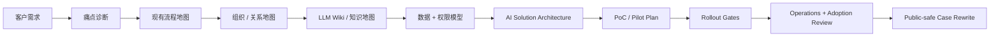

# AI First FDE Skill

AI First FDE Skill 是一套 Markdown-only、no-build 的前线部署工程师 Skill Suite，专门用于东亚企业的 AI 现场导入、流程转型、知识整理、PoC、Pilot、Rollout 与运维交接。

这套 Skill 的方向不是“用 AI 裁员”，而是“用 AI 推动转型”。在东亚企业环境里，AI 要真正落地，不能只讲效率，更要保护专业、保留尊严、降低加班、减少重工，让原本熟悉流程的人从重复工作转向审核、训练、判断、改善与管理。这不是附带的价值观，而是这套 Skill 的核心卖点：人道、务实、可落地。

## Quick Start

```bash
git clone https://github.com/jacksoncoin0202-ops/ai-first-fde-skill.git
cd ai-first-fde-skill
```

然后对 agent 说：

```text
请先读 skills/ai-first-fde/SKILL.md。
如果任务需要研究、诊断、架构、部署、排障、采用观察、组织架构图或企业知识库整理，请再读对应的 skills/ai-first-fde-* 模块与 skills/ai-first-fde/references/。
```

只要 agent 能读 Markdown 或 project rules，就可以使用这套 Skill，例如 Claude Code、OpenAI Codex CLI、Cursor、Hermes、OpenCode、Gemini CLI、Cline、Aider、Continue、Devin CLI、OpenRouter-backed agents，以及其他相近的 CLI / Agent 工具。

## 语言选择

- [English](README.en.md)
- [繁體中文](README.zh-Hant.md)
- [简体中文](README.zh-CN.md)
- [日本語](README.ja.md)

## 为什么需要这套 Skill

企业 AI 项目通常不是因为“不会写 prompt”而失败。真正的问题多半藏在流程、组织、数据、权限和人际关系里。

常见状况包括：

- 流程没有清楚 owner；
- 权威数据来源不明确；
- 审批流程其实靠非正式关系运作；
- senior reviewer 不信任 AI 输出的质量；
- frontline user 担心被责怪、增加工作量，甚至担心被取代；
- legal、security、compliance、procurement、IT 太晚才被拉进来；
- pilot 没有可以衡量的 KPI；
- solution 还没看清楚组织架构就开始建；
- 知识分散在 email、spreadsheet、chat、PDF、ticket system 和个人记忆里。

AI First FDE Skill 把这些问题变成可执行的工作顺序：agent 要问什么、画什么、交付什么、何时停手、何时可以 scale、需要什么 evidence，全都用操作指南形式写清楚。

## 东亚式 AI 转型立场

这套 Skill 不是欧美式“用自动化替代人”的 rollout playbook。

在日本、香港、台湾、韩国、新加坡，以及相近文化的企业团队里，AI adoption 的打法应该不同：

- 把 AI 定位成减少加班、返工、等待、context switching 和 cognitive load；
- 把有经验的员工变成 reviewer、trainer、approver、process owner，而不是把他们边缘化；
- 避免用 AI 指标公开羞辱 frontline user；
- 先做低风险 quick win，再逐步 rollout；
- 先取得 manager、senior staff、informal influencer 的共识，再正式宣布流程改变；
- 把沉默、拖延、表面同意、低使用率视为诊断信号，而不是“不合作”；
- 让转型有人情味：让员工看到自己如何从重复工作走向更高价值的判断工作。

这同时是伦理立场，也是商业卖点。令人害怕的 AI 系统会被抵抗；能保护专业、改善工作生活、减少无谓消耗的 AI 系统，才有机会成为真正的日常运作。

## 它实际做什么

AI First FDE Skill 让 agent 像 Forward Deployed Engineer 一样工作：

- 先找真正业务痛点，再谈工具；
- 用真实文件、ticket、表格、email、log 重建现有流程；
- 盘点组织架构、decision rights、approval route、informal veto point；
- 找出 sponsor、workflow owner、daily users、senior reviewer、staff functions 和隐性阻力；
- 产出组织架构图、关系图、流程交接图和责任地图；
- 把分散的企业知识整理成 LLM Wiki / knowledge base 结构；
- 定义数据来源、权限模型、治理边界、审计记录和人工审批点；
- 设计窄范围、可恢复、可衡量的 PoC / Pilot；
- 定义 KPI、validation method、rollback path、operations owner；
- 针对现场事故按层排障；
- 把真实项目改写成 public-safe case，不暴露客户细节。

## 操作模型



这个顺序很重要。不要一开始就选模型、买工具、写 demo。先把组织、流程、数据和关系变得可见，再设计技术方案。

## 核心能力

### 1. 流程与痛点诊断

这套 Skill 先问现场，而不是直接给 AI use case 清单。它会要求 agent 找最近三个真实案例，重建流程、handoff、等待、返工、审批、错误、workaround、数据来源和输出。

最后产出的 Problem Map 会清楚写出：

- 痛点类型：时间、错误、返工、风险、排队、成本、错失收入、员工挫败；
- workflow owner；
- daily users；
- approval path；
- current evidence；
- AI 可以安全介入的步骤；
- 必须保留 human approval 的步骤。

### 2. 组织架构图与关系图

企业 AI 落地需要的不只是 software architecture，更需要 organization architecture。

这套 Skill 新增了组织可视化层，可以产出：

- Organization Architecture Map；
- Stakeholder Relationship Map；
- Decision / Approval Route；
- Informal Veto Map；
- Workflow Handoff Map；
- Data Ownership Map；
- Escalation Path；
- AI Operating Responsibility Map。

如果环境有 diagram tool，可以把内容转成漂亮的大型架构图或关系图；如果没有，也可以直接输出 Mermaid 与 Markdown，用于 GitHub、Notion、Obsidian、内部 wiki、简报或 agent context。

### 3. LLM Wiki 与企业知识整理

很多企业不是缺 AI，而是缺“可信、可维护、可追溯”的知识结构。

AI First FDE Skill 把知识库当成部署的一部分来处理：

- 哪份文件是 source of truth？
- 哪些文件已过期？
- 哪个团队 owner 负责哪个 knowledge domain？
- 哪些内容可以让 AI 读？
- 哪些内容必须限制在部门内？
- 哪些互相矛盾的信息需要人工确认？
- 哪些更新必须留 log？
- 哪些主题应该变成可重用的 wiki page？

Skill 会产出 LLM Wiki handoff plan，包含 domain taxonomy、source register、owner matrix、permission matrix、update cadence、contradiction log 和 retrieval boundary。

### 4. 数据、权限与治理模型

每一份 architecture plan 都必须包含：

- data sources；
- ingestion path；
- permission boundaries；
- sensitive fields；
- audit logging；
- human approval gates；
- failure modes；
- fallback workflow；
- rollback plan；
- operations owner。

这样可以避免“demo 很漂亮，但 production 过不了 security / compliance / IT / operations review”的常见失败。

### 5. PoC、Pilot、Rollout、Operations

这套 Skill 会把 proof 和 deployment 分开：

- PoC：用真实 artifact 证明一个窄任务可行；
- Pilot：证明真实使用者可以在受控流程中安全使用；
- Rollout：只有在 KPI、使用率、风险控制和 owner ready 后才扩大；
- Operations：定义 monitoring、support、access review、cost review、quality review、incident response、knowledge refresh。

### 6. AI-First Engineering Core

当任务包含 implementation，这套 Skill 会直接套用无依赖的 AI-first engineering operating model：

- planning quality 先于 typing speed；
- eval coverage 先于 anecdotal confidence；
- explicit boundaries、stable contracts、typed interfaces、deterministic tests；
- code review 聚焦 behavior regressions、security assumptions、data integrity、failure handling、rollout safety；
- touched domains 要有 regression coverage，interface boundaries 要有 integration checks。

## Core and Optional Add-ons

默认 `ai-first-fde` skill 是无依赖核心。它只靠 Markdown、Mermaid、tables 和 checklists 就能运作。

有依赖的能力已经分开放到 [skills/ai-first-fde-addons/SKILL.md](skills/ai-first-fde-addons/SKILL.md)。不要默认安装或启用 add-ons。只有在使用者明确想要进阶 artifact，例如 rendered diagram、knowledge graph、eval harness、security scan、slide deck 时，才使用 add-on。

普通通讯和办公工具不是 add-ons。chat app、email、calendar、notes、spreadsheets 只是 input sources，不是 dependencies。

| FDE 阶段 | Optional add-on examples | 输出 |
|---|---|---|
| Research grounding | arXiv、market research、competitive analysis、deep research | Source pack、benchmark notes、public-safe brief |
| Deep diagnostic | support-ticket triage、meeting insight extraction、enterprise AI consulting | Pain clusters、stakeholder questions、diagnostic plan |
| Organization visualization | architecture diagram、graphify、diagramming、Figma、Excalidraw、infographic | Organization map、relationship diagram、approval route |
| Knowledge architecture | LLM Wiki、graphify、codebase onboarding、content hash cache | Source register、taxonomy、owner matrix、contradiction log |
| Agent runtime planning | agent harness、enterprise agent ops、cost-aware LLM pipeline | Runtime table、context strategy、tool boundary、cost route |
| Evaluation and rollout | eval harness、AI regression testing、verification loop、e2e testing | Pilot gates、acceptance tests、rollout readiness |
| Governance and safety | threat model、security review、security scan、public-safe checklist | Permission review、risk model、go / no-go gate |
| Executive enablement | presentations、slide deck、infographic、article writing、brand voice | Executive summary、training deck、public-safe case |

如果 add-on 不存在，核心 Skill 仍然用 Markdown 和 Mermaid 产出同一份 artifact。安装是 optional，而且要分开处理。

## 模块

- `ai-first-fde`：主控 orchestration skill
- `ai-first-fde-addons`：有依赖的 optional add-ons，用于进阶 artifacts
- `ai-first-fde-research`：公开来源研究与 source grounding
- `ai-first-fde-diagnostic`：客户深度诊断
- `ai-first-fde-architecture`：AI solution architecture
- `ai-first-fde-deployment`：PoC、Pilot、Rollout、Operations
- `ai-first-fde-troubleshooting`：现场排障
- `ai-first-fde-adoption-observer`：使用者阻力与 adoption observation

## 标准交付物

| 交付物 | 用途 |
|---|---|
| Engagement Brief | 定义客户、部门、流程、sponsor、限制、30/60/90 天目标。 |
| Problem Map | 把痛点、流程、数据、权限、quick wins 变得可见。 |
| Stakeholder Map | 找出 sponsor、workflow owner、users、reviewers、staff functions、blockers。 |
| Organization Architecture Map | 画出部门、owner、approval route、handoff、escalation path。 |
| Relationship Diagram | 在 rollout 前看清正式与非正式影响力。 |
| LLM Wiki Handoff | 把分散知识整理成可维护的 wiki structure。 |
| Data / Permission Model | 定义 source of truth、access boundary、logging、sensitive fields。 |
| Technical Solution Architecture | 设计 AI、agent、tool integration、human gate、failure handling。 |
| PoC Plan | 用真实 artifact 验证窄任务。 |
| Pilot Plan | 用真实使用者、KPI、feedback、fallback、sponsor review 做受控测试。 |
| Deployment Runbook | 控制 rollout、rollback、training、support、acceptance gate。 |
| Adoption Risk Register | 追踪阻力、恐惧、manager alignment、usage signal。 |
| Troubleshooting Report | 按层诊断事故并防止 recurrence。 |
| Operations Handbook | 指派 monitoring、access review、knowledge refresh、cost review、support。 |
| Executive Summary | 给管理层看的决策、计划、风险和下一步。 |
| Public-safe Case Rewrite | 把机密项目改写成匿名公开案例。 |

## 典型执行流程

1. 问清楚哪个 workflow 在 scope 内。
2. 要求提供最近三个真实案例。
3. 重建现有流程。
4. 标记痛点、风险、等待、返工。
5. 画出 sponsor、workflow owner、daily users、reviewers、IT、security、legal、compliance、hidden blockers。
6. 产出 organization architecture 与 relationship map。
7. 为分散知识建立 LLM Wiki structure。
8. 定义 minimum viable dataset 和 permission boundary。
9. 选一个低风险 pilot。
10. 定义 KPI、human oversight、logging、fallback、stop criteria、rollout gate。
11. 做 sponsor review 和 user feedback loop。
12. 只有在 measured value 和 operations ownership 成立后才 scale。

## 无依赖 / 不需要编译

使用这套 Skill 不需要 Python、npm、pip、Docker、compiler 或 binary installer。

Skill 本身就是 Markdown。Python validator 只给维护者和 CI 使用，普通使用者不用安装。你只需要 clone repo，打开 Markdown，叫 agent follow 即可。

进阶 diagram、wiki、graph、eval、security、deck 输出已分开放到 optional add-on skill；它们不是 core skill 的必要依赖。

## Agent / CLI 下载指南

常见 agent runtime 和 CLI 下载方法见：

[docs/agent-runtime-download-guide.zh-Hant.md](docs/agent-runtime-download-guide.zh-Hant.md)

指南涵盖 Claude Code、Codex、Cursor、OpenRouter-backed agents、OpenCode / OpenCLI-style tools、Hermes，以及相近的 CLI-based workflows。

## Public Safety

这是公开 repo。不要提交客户名称、内部架构、合约、credential、内部 URL、员工姓名或可识别的部署细节。

写公开材料时：

- 匿名化公司与部门名称；
- 移除内部路径、URL、截图、credential 和具体架构细节；
- 把真实案例改写成 reusable pattern；
- 只引用公开来源；
- 不要把 private memory 或本机文件当成 public evidence。

## 研究基础

本 Skill 参考企业 AI 落地实务、东亚组织文化、负责任 AI 治理、Stanford Digital Economy Lab 2026 Enterprise AI Playbook、Stanford HAI / AI Index、NIST、OECD、Microsoft WorkLab、McKinsey、日本 METI / MIC 等公开资料，以及企业 AI 现场导入经验模式。

本 repo 不代表任何引用机构背书。

## License

MIT License.
