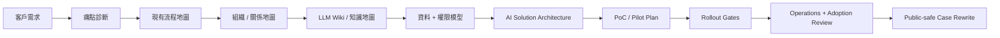

# AI First FDE Skill

AI First FDE Skill 是一套 Markdown-only、no-build 的前線部署工程師 Skill Suite，專門用於東亞企業的 AI 現場導入、流程轉型、知識整理、PoC、Pilot、Rollout 與維運交接。

這套 Skill 的方向不是「用 AI 裁員」，而是「用 AI 推動轉型」。在東亞企業環境裡，AI 要真正落地，不能只講效率，更要保護專業、保留尊嚴、降低加班、減少重工，讓原本熟悉流程的人從重複工作轉向審核、訓練、判斷、改善與管理。這不是附帶的價值觀，而是這套 Skill 的核心賣點：人道、務實、可落地。

## Quick Start

```bash
git clone https://github.com/jacksoncoin0202-ops/ai-first-fde-skill.git
cd ai-first-fde-skill
```

然後對 agent 說：

```text
請先讀 skills/ai-first-fde/SKILL.md。
如果任務需要研究、診斷、架構、部署、排障、採用觀察、組織架構圖或企業知識庫整理，請再讀對應的 skills/ai-first-fde-* 模組與 skills/ai-first-fde/references/。
```

只要 agent 能讀 Markdown 或 project rules，就可以使用這套 Skill，例如 Claude Code、OpenAI Codex CLI、Cursor、Hermes、OpenCode、Gemini CLI、Cline、Aider、Continue、Devin CLI、OpenRouter-backed agents，以及其他相近的 CLI / Agent 工具。

## 語言選擇

- [English](README.en.md)
- [繁體中文](README.zh-Hant.md)
- [簡體中文](README.zh-CN.md)
- [日本語](README.ja.md)

## 為什麼需要這套 Skill

企業 AI 專案通常不是因為「不會寫 prompt」而失敗。真正的問題多半藏在流程、組織、資料、權限和人際關係裡。

常見狀況包括：

- 流程沒有清楚 owner；
- 權威資料來源不明確；
- 審批流程其實靠非正式關係運作；
- senior reviewer 不信任 AI 輸出的品質；
- frontline user 擔心被責怪、增加工作量，甚至擔心被取代；
- legal、security、compliance、procurement、IT 太晚才被拉進來；
- pilot 沒有可以量度的 KPI；
- solution 還沒看清楚組織架構就開始建；
- 知識分散在 email、spreadsheet、chat、PDF、ticket system 和個人記憶裡。

AI First FDE Skill 把這些問題變成可執行的工作順序：agent 要問什麼、畫什麼、交付什麼、何時停手、何時可以 scale、需要什麼 evidence，全都用操作指南形式寫清楚。

## 東亞式 AI 轉型立場

這套 Skill 不是歐美式「用自動化替代人」的 rollout playbook。

在日本、香港、台灣、韓國、新加坡，以及相近文化的企業團隊裡，AI adoption 的打法應該不同：

- 把 AI 定位成減少加班、返工、等待、context switching 和 cognitive load；
- 把有經驗的員工變成 reviewer、trainer、approver、process owner，而不是把他們邊緣化；
- 避免用 AI 指標公開羞辱 frontline user；
- 先做低風險 quick win，再逐步 rollout；
- 先取得 manager、senior staff、informal influencer 的共識，再正式宣布流程改變；
- 把沉默、拖延、表面同意、低使用率視為診斷訊號，而不是「不合作」；
- 讓轉型有人情味：讓員工看到自己如何從重複工作走向更高價值的判斷工作。

這同時是倫理立場，也是商業賣點。令人害怕的 AI 系統會被抵抗；能保護專業、改善工作生活、減少無謂消耗的 AI 系統，才有機會成為真正的日常運作。

## 它實際做什麼

AI First FDE Skill 讓 agent 像 Forward Deployed Engineer 一樣工作：

- 先找真正業務痛點，再談工具；
- 用真實文件、ticket、表格、email、log 重建現有流程；
- 盤點組織架構、decision rights、approval route、informal veto point；
- 找出 sponsor、workflow owner、daily users、senior reviewer、staff functions 和隱性阻力；
- 產出組織架構圖、關係圖、流程交接圖和責任地圖；
- 把分散的企業知識整理成 LLM Wiki / knowledge base 結構；
- 定義資料來源、權限模型、治理邊界、審計紀錄和人工審批點；
- 設計窄範圍、可回復、可量度的 PoC / Pilot；
- 定義 KPI、validation method、rollback path、operations owner；
- 針對現場事故按層排障；
- 把真實專案改寫成 public-safe case，不暴露客戶細節。

## 操作模型



這個順序很重要。不要一開始就選模型、買工具、寫 demo。先把組織、流程、資料和關係變得可見，再設計技術方案。

## 核心能力

### 1. 流程與痛點診斷

這套 Skill 先問現場，而不是直接給 AI use case 清單。它會要求 agent 找最近三個真實案例，重建流程、handoff、等待、返工、審批、錯誤、workaround、資料來源和輸出。

最後產出的 Problem Map 會清楚寫出：

- 痛點類型：時間、錯誤、返工、風險、排隊、成本、錯失收入、員工挫敗；
- workflow owner；
- daily users；
- approval path；
- current evidence；
- AI 可以安全介入的步驟；
- 必須保留 human approval 的步驟。

### 2. 組織架構圖與關係圖

企業 AI 落地需要的不只是 software architecture，更需要 organization architecture。

這套 Skill 新增了組織可視化層，可以產出：

- Organization Architecture Map；
- Stakeholder Relationship Map；
- Decision / Approval Route；
- Informal Veto Map；
- Workflow Handoff Map；
- Data Ownership Map；
- Escalation Path；
- AI Operating Responsibility Map。

如果環境有 diagram tool，可以把內容轉成漂亮的大型架構圖或關係圖；如果沒有，也可以直接輸出 Mermaid 與 Markdown，用於 GitHub、Notion、Obsidian、內部 wiki、簡報或 agent context。

### 3. LLM Wiki 與企業知識整理

很多企業不是缺 AI，而是缺「可信、可維護、可追溯」的知識結構。

AI First FDE Skill 把知識庫當成部署的一部分來處理：

- 哪份文件是 source of truth？
- 哪些文件已過期？
- 哪個團隊 owner 負責哪個 knowledge domain？
- 哪些內容可以讓 AI 讀？
- 哪些內容必須限制在部門內？
- 哪些互相矛盾的資訊需要人工確認？
- 哪些更新必須留 log？
- 哪些主題應該變成可重用的 wiki page？

Skill 會產出 LLM Wiki handoff plan，包含 domain taxonomy、source register、owner matrix、permission matrix、update cadence、contradiction log 和 retrieval boundary。

### 4. 資料、權限與治理模型

每一份 architecture plan 都必須包含：

- data sources；
- ingestion path；
- permission boundaries；
- sensitive fields；
- audit logging；
- human approval gates；
- failure modes；
- fallback workflow；
- rollback plan；
- operations owner。

這樣可以避免「demo 很漂亮，但 production 過不了 security / compliance / IT / operations review」的常見失敗。

### 5. PoC、Pilot、Rollout、Operations

這套 Skill 會把 proof 和 deployment 分開：

- PoC：用真實 artifact 證明一個窄任務可行；
- Pilot：證明真實使用者可以在受控流程中安全使用；
- Rollout：只有在 KPI、使用率、風險控制和 owner ready 後才擴大；
- Operations：定義 monitoring、support、access review、cost review、quality review、incident response、knowledge refresh。

### 6. AI-First Engineering Core

當任務包含 implementation，這套 Skill 會直接套用無依賴的 AI-first engineering operating model：

- planning quality 先於 typing speed；
- eval coverage 先於 anecdotal confidence；
- explicit boundaries、stable contracts、typed interfaces、deterministic tests；
- code review 聚焦 behavior regressions、security assumptions、data integrity、failure handling、rollout safety；
- touched domains 要有 regression coverage，interface boundaries 要有 integration checks。

## Core and Optional Add-ons

預設 `ai-first-fde` skill 是無依賴核心。它只靠 Markdown、Mermaid、tables 和 checklists 就能運作。

有依賴的能力已經分開放到 [skills/ai-first-fde-addons/SKILL.md](skills/ai-first-fde-addons/SKILL.md)。不要預設安裝或啟用 add-ons。只有在使用者明確想要進階 artifact，例如 rendered diagram、knowledge graph、eval harness、security scan、slide deck 時，才使用 add-on。

普通通訊和辦公工具不是 add-ons。chat app、email、calendar、notes、spreadsheets 只是 input sources，不是 dependencies。

| FDE 階段 | Optional add-on examples | 輸出 |
|---|---|---|
| Research grounding | arXiv、market research、competitive analysis、deep research | Source pack、benchmark notes、public-safe brief |
| Deep diagnostic | support-ticket triage、meeting insight extraction、enterprise AI consulting | Pain clusters、stakeholder questions、diagnostic plan |
| Organization visualization | architecture diagram、graphify、diagramming、Figma、Excalidraw、infographic | Organization map、relationship diagram、approval route |
| Knowledge architecture | LLM Wiki、graphify、codebase onboarding、content hash cache | Source register、taxonomy、owner matrix、contradiction log |
| Agent runtime planning | agent harness、enterprise agent ops、cost-aware LLM pipeline | Runtime table、context strategy、tool boundary、cost route |
| Evaluation and rollout | eval harness、AI regression testing、verification loop、e2e testing | Pilot gates、acceptance tests、rollout readiness |
| Governance and safety | threat model、security review、security scan、public-safe checklist | Permission review、risk model、go / no-go gate |
| Executive enablement | presentations、slide deck、infographic、article writing、brand voice | Executive summary、training deck、public-safe case |

如果 add-on 不存在，核心 Skill 仍然用 Markdown 和 Mermaid 產出同一份 artifact。安裝是 optional，而且要分開處理。

## 模組

- `ai-first-fde`：主控 orchestration skill
- `ai-first-fde-addons`：有依賴的 optional add-ons，用於進階 artifacts
- `ai-first-fde-research`：公開來源研究與 source grounding
- `ai-first-fde-diagnostic`：客戶深度診斷
- `ai-first-fde-architecture`：AI solution architecture
- `ai-first-fde-deployment`：PoC、Pilot、Rollout、Operations
- `ai-first-fde-troubleshooting`：現場排障
- `ai-first-fde-adoption-observer`：使用者阻力與 adoption observation

## 標準交付物

| 交付物 | 用途 |
|---|---|
| Engagement Brief | 定義客戶、部門、流程、sponsor、限制、30/60/90 天目標。 |
| Problem Map | 把痛點、流程、資料、權限、quick wins 變得可見。 |
| Stakeholder Map | 找出 sponsor、workflow owner、users、reviewers、staff functions、blockers。 |
| Organization Architecture Map | 畫出部門、owner、approval route、handoff、escalation path。 |
| Relationship Diagram | 在 rollout 前看清正式與非正式影響力。 |
| LLM Wiki Handoff | 把分散知識整理成可維護的 wiki structure。 |
| Data / Permission Model | 定義 source of truth、access boundary、logging、sensitive fields。 |
| Technical Solution Architecture | 設計 AI、agent、tool integration、human gate、failure handling。 |
| PoC Plan | 用真實 artifact 驗證窄任務。 |
| Pilot Plan | 用真實使用者、KPI、feedback、fallback、sponsor review 做受控測試。 |
| Deployment Runbook | 控制 rollout、rollback、training、support、acceptance gate。 |
| Adoption Risk Register | 追蹤阻力、恐懼、manager alignment、usage signal。 |
| Troubleshooting Report | 按層診斷事故並防止 recurrence。 |
| Operations Handbook | 指派 monitoring、access review、knowledge refresh、cost review、support。 |
| Executive Summary | 給管理層看的決策、計劃、風險和下一步。 |
| Public-safe Case Rewrite | 把機密專案改寫成匿名公開案例。 |

## 典型執行流程

1. 問清楚哪個 workflow 在 scope 內。
2. 要求提供最近三個真實案例。
3. 重建現有流程。
4. 標記痛點、風險、等待、返工。
5. 畫出 sponsor、workflow owner、daily users、reviewers、IT、security、legal、compliance、hidden blockers。
6. 產出 organization architecture 與 relationship map。
7. 為分散知識建立 LLM Wiki structure。
8. 定義 minimum viable dataset 和 permission boundary。
9. 選一個低風險 pilot。
10. 定義 KPI、human oversight、logging、fallback、stop criteria、rollout gate。
11. 做 sponsor review 和 user feedback loop。
12. 只有在 measured value 和 operations ownership 成立後才 scale。

## 無依賴 / 不需要編譯

使用這套 Skill 不需要 Python、npm、pip、Docker、compiler 或 binary installer。

Skill 本身就是 Markdown。Python validator 只給維護者和 CI 使用，普通使用者不用安裝。你只需要 clone repo，打開 Markdown，叫 agent follow 即可。

進階 diagram、wiki、graph、eval、security、deck 輸出已分開放到 optional add-on skill；它們不是 core skill 的必要依賴。

## Agent / CLI 下載指南

常見 agent runtime 和 CLI 下載方法見：

[docs/agent-runtime-download-guide.zh-Hant.md](docs/agent-runtime-download-guide.zh-Hant.md)

指南涵蓋 Claude Code、Codex、Cursor、OpenRouter-backed agents、OpenCode / OpenCLI-style tools、Hermes，以及相近的 CLI-based workflows。

## Public Safety

這是公開 repo。不要提交客戶名稱、內部架構、合約、credential、內部 URL、員工姓名或可識別的部署細節。

寫公開材料時：

- 匿名化公司與部門名稱；
- 移除內部路徑、URL、截圖、credential 和具體架構細節；
- 把真實案例改寫成 reusable pattern；
- 只引用公開來源；
- 不要把 private memory 或本機文件當成 public evidence。

## 研究基礎

本 Skill 參考企業 AI 落地實務、東亞組織文化、負責任 AI 治理、Stanford Digital Economy Lab 2026 Enterprise AI Playbook、Stanford HAI / AI Index、NIST、OECD、Microsoft WorkLab、McKinsey、日本 METI / MIC 等公開資料，以及企業 AI 現場導入經驗模式。

本 repo 不代表任何引用機構背書。

## License

MIT License.
