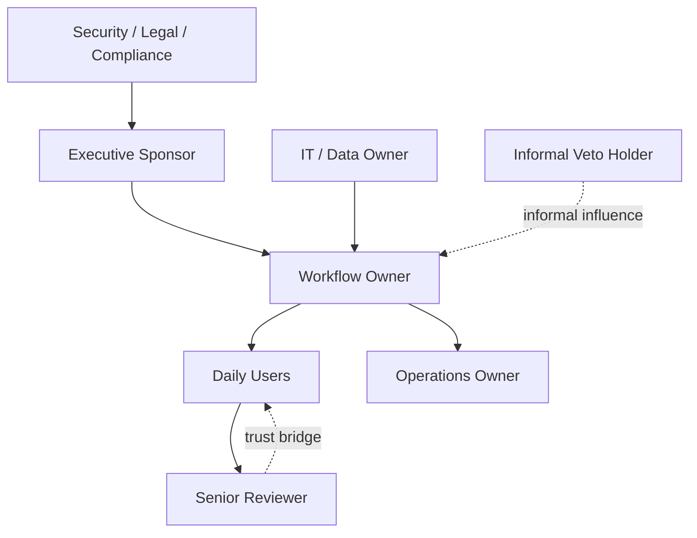

# Organization Map and LLM Wiki Playbook

## Objective

Make the enterprise structure visible before designing AI.

In East Asian enterprise deployments, the formal process and the real process are often different. The FDE must capture both without embarrassing the client. Use diagrams, maps, and wiki structures to make invisible work visible.

## When to use this playbook

Use this reference when any of the following is true:

- more than one department touches the workflow;
- approval depends on senior reviewers, committees, or informal relationships;
- the client cannot clearly name the data owner;
- users say the written SOP does not match the real process;
- knowledge lives in email, chat, spreadsheets, PDFs, shared drives, ticket systems, or individual memory;
- the user asks for a more professional, complete, visual, or enterprise-ready deliverable;
- the user wants an organization chart, relationship graph, architecture diagram, wiki, or knowledge graph.

## East Asia transformation rule

Do not present the map as a tool for eliminating people.

Present it as a transformation map:

- reduce overtime;
- reduce repetitive administration;
- reduce waiting and rework;
- preserve senior expertise;
- give experienced staff reviewer / trainer / approver roles;
- make handoffs clearer;
- make escalation less personal and less humiliating;
- turn implicit knowledge into shared team assets.

## Output stack

Produce these artifacts when the project is complex:

1. Organization Architecture Map
2. Stakeholder Relationship Diagram
3. Decision / Approval Route
4. Workflow Handoff Map
5. Data Ownership Map
6. Escalation Path
7. AI Operating Responsibility Map
8. LLM Wiki Handoff
9. Knowledge Source Register
10. Knowledge Permission Matrix

## Organization Architecture Map

Capture departments, roles, formal ownership, real influence, and handoffs.

Required fields:

| Node | Type | Formal responsibility | Real influence | Inputs | Outputs | Risk if skipped |
|---|---|---|---|---|---|---|
| | Department / role / system / person | | | | | |

Map these nodes:

- business sponsor;
- workflow owner;
- daily users;
- senior reviewer;
- data owner;
- IT / system owner;
- security;
- legal;
- compliance;
- procurement;
- HR, if job role change is involved;
- informal veto holder;
- operations owner after rollout.

## Relationship Diagram

Use this when hierarchy, seniority, or face-saving matters.

Do not only draw reporting lines. Draw:

- who trusts whom;
- who can block quietly;
- who users ask for approval even without formal title;
- who needs private alignment before public rollout;
- who should be given reviewer status;
- who may feel loss of status if the AI is introduced badly.

Mermaid starter:

## Workflow Handoff Map

For each workflow step, capture:

- trigger;
- input;
- actor;
- system;
- data source;
- output;
- waiting time;
- error / rework point;
- approval point;
- AI assist opportunity;
- human approval requirement;
- fallback path.

## LLM Wiki Handoff

Use this when knowledge is scattered.

Do not jump directly to RAG. First create a maintainable knowledge structure.

Required sections:

### 1. Domain taxonomy

Define 5-12 knowledge domains.

Example:

- customer support;
- product policy;
- legal / compliance;
- sales process;
- technical support;
- operations SOP;
- pricing and contract terms;
- escalation cases.

### 2. Source register

| Source | Type | Owner | Freshness | Permission | Use in AI | Notes |
|---|---|---|---|---|---|---|
| | SOP / PDF / ticket / email / chat / spreadsheet / wiki | | current / stale / disputed | public / team / restricted | read / cite / summarize / exclude | |

### 3. Owner matrix

| Domain | Business owner | Knowledge updater | Reviewer | Approval cadence |
|---|---|---|---|---|
| | | | | |

### 4. Permission matrix

| Knowledge type | Who may view | Who may edit | AI allowed action | Never expose |
|---|---|---|---|---|
| | | | read / summarize / cite / draft / exclude | |

### 5. Contradiction log

| Conflict | Source A | Source B | Owner | Decision needed | Status |
|---|---|---|---|---|---|
| | | | | | |

### 6. Update cadence

Define:

- what triggers an update;
- who updates the wiki;
- who approves the update;
- how stale pages are flagged;
- how pilot learnings become new wiki pages;
- how public-safe summaries are separated from private knowledge.

## Diagram and wiki tool stitching

If adjacent skills are available, use them like this:

| Need | Skill type | Output |
|---|---|---|
| professional dark architecture diagram | architecture-diagram | self-contained HTML / SVG diagram |
| relationship or knowledge graph | graphify / diagramming | interactive graph, JSON, report, Mermaid, SVG |
| persistent enterprise knowledge base | llm-wiki | Markdown wiki with schema, index, log, raw sources |
| codebase / system onboarding | codebase-onboarding | architecture, entrypoints, conventions, handoff notes |
| slide or executive visual | presentations / baoyu-slide-deck / baoyu-infographic | deck, infographic, management-ready visual |

If these tools are unavailable, produce plain Markdown and Mermaid instead. The core FDE method must still work.

## Acceptance criteria

The artifact is acceptable only if:

- every workflow has an owner;
- every key data source has an owner and permission boundary;
- every approval route is visible;
- informal blockers are named as roles or anonymized stakeholder types;
- senior expertise is preserved through reviewer / trainer / approver roles;
- LLM Wiki sources are classified by owner, freshness, permission, and AI usage;
- the diagram can be understood by a manager, IT owner, and daily user;
- the output avoids exposing confidential client identifiers.
