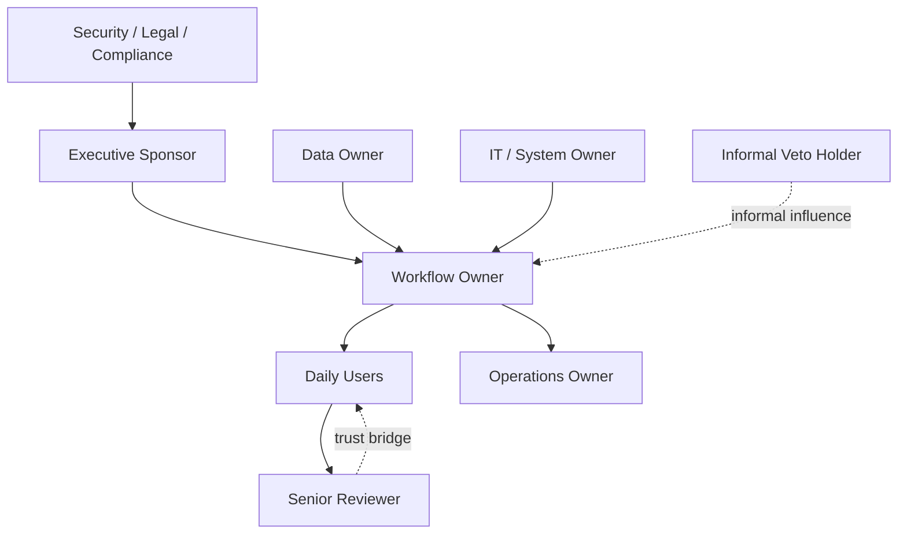

# Organization Architecture Map

## 1. 轉型立場

- 本專案定位：
- 如何減少加班 / 返工 / 重複行政：
- 如何保留 senior expertise：
- 哪些角色會成為 reviewer / trainer / approver / process owner：
- 哪些說法必須避免，以免造成裁員恐懼：

## 2. 組織節點

| Node | Type | Formal responsibility | Real influence | Inputs | Outputs | Risk if skipped |
|---|---|---|---|---|---|---|
| Executive sponsor | Role | | | | | |
| Workflow owner | Role | | | | | |
| Daily users | User group | | | | | |
| Senior reviewer | Role | | | | | |
| Data owner | Team / role | | | | | |
| IT / system owner | Team | | | | | |
| Security / legal / compliance | Staff function | | | | | |
| Informal veto holder | Role | | | | | |
| Operations owner | Role | | | | | |

## 3. Decision / Approval Route

| Decision | Proposer | Reviewer | Approver | Evidence required | Risk if delayed |
|---|---|---|---|---|---|
| Pilot scope | | | | | |
| Data access | | | | | |
| AI output policy | | | | | |
| Rollout gate | | | | | |

## 4. Workflow Handoff Map

| Step | Actor | System | Input | Output | Waiting / rework | AI assist | Human approval | Fallback |
|---|---|---|---|---|---|---|---|---|
| | | | | | | | | |

## 5. Relationship Diagram

## 6. Escalation Path

- Quality issue:
- Permission issue:
- User resistance:
- Compliance concern:
- System incident:
- Sponsor decision:

## 7. AI Operating Responsibility

| Responsibility | Owner | Backup | Review cadence | Evidence |
|---|---|---|---|---|
| Prompt / instruction update | | | | |
| Knowledge refresh | | | | |
| Access review | | | | |
| KPI review | | | | |
| Incident response | | | | |
| Training | | | | |

## 8. Open Questions

- 
